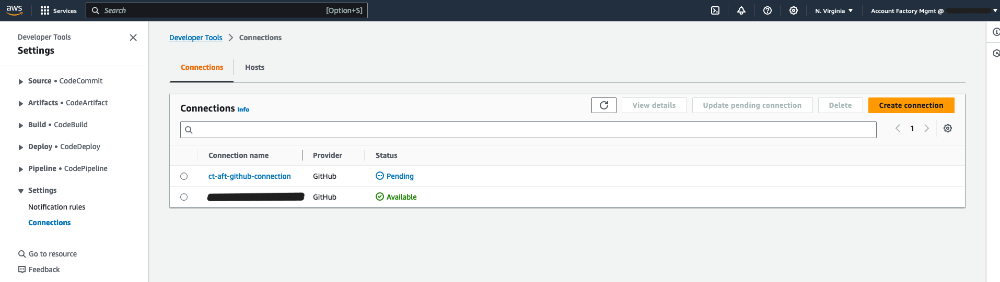
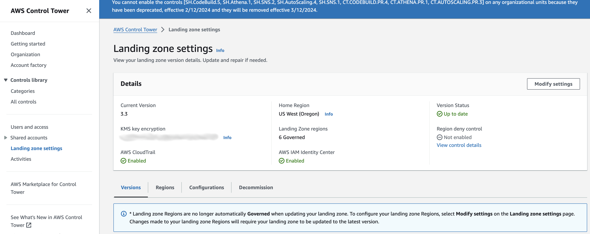
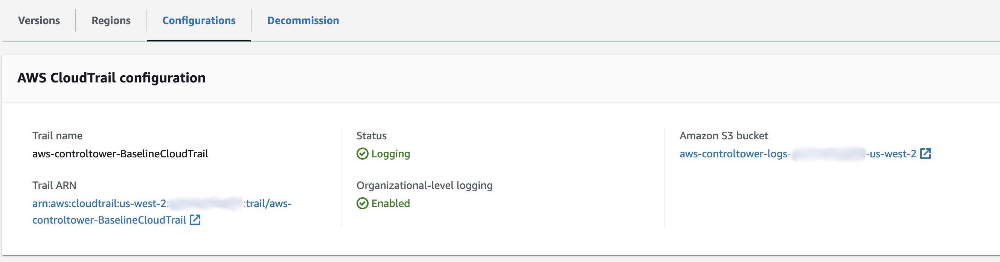
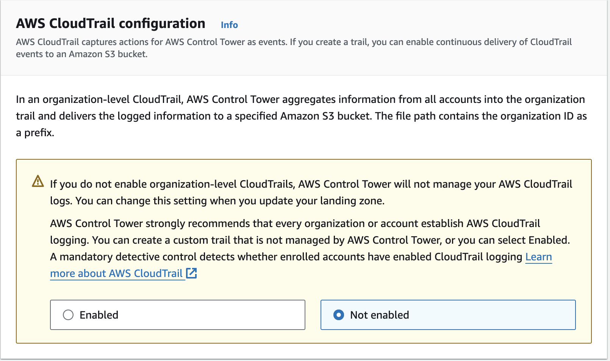
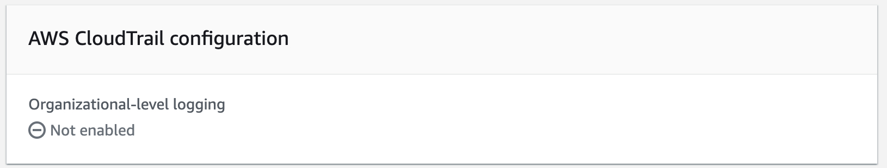
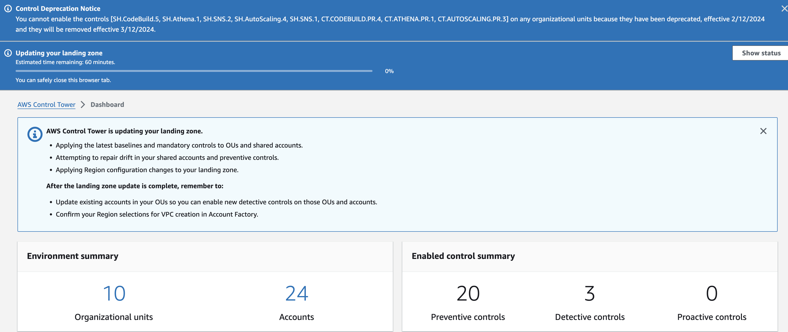
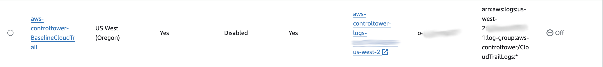

# Account Factory for Terraform (AFT)

`NOTE:` Version tags directly correlate with the current version of [AFT](https://github.com/aws-ia/terraform-aws-control_tower_account_factory).

This Terraform module is designed to establish and configure the [Account Factory for Terraform (AFT)](https://github.com/aws-ia/terraform-aws-control_tower_account_factory), an official Terraform module curated by the AWS Control Tower team. AFT enables the provisioning and customization of AWS accounts utilizing Terraform, facilitated through a deployment pipeline leveraging AWS CodeBuild and CodePipeline. It is intended to be integrated within your project's Terraform codebase, ensuring the foundational components of AFT are appropriately set up.

## AWS Landing Zone Best Practices

https://docs.aws.amazon.com/controltower/latest/userguide/aws-multi-account-landing-zone.html

## AFT Overview

Numerous resources across the internet offer detailed explanations and tutorials on AFT. This section is intended to provide a succinct introduction and serve as a quick reference.

### What belongs in AFT?

AFT allows for the incorporation of various AWS resources, enabling users to manage and provision resources efficiently. For instance, should there be a requirement to deploy EKS clusters across multiple AWS accounts, the relevant Terraform scripts can be integrated into the tf-aws-aft-customization-global. However, given the expansive scope of AFT and its primary objective to facilitate the provisioning and management of AWS accounts, it is advisable to limit additions to the AFT repositories to essential foundational elements that are universally required. For example, the implementation of cross-account roles for different segments of your application or infrastructure can be incorporated into AFT. Similarly, foundational components for centralized logging, such as IAM roles for cross-account access, can be added, though specific resources for directing application logs to CloudWatch Logs should be excluded. The determination of what should or should not be included in AFT is nuanced and requires careful consideration. As a general guideline, resources should only be added to AFT under thoughtful and limited circumstances, striving to maintain the AFT codebase as streamlined and focused as possible.

### AFT Code Repositories

Since AFT utilizes [GitOps](https://en.wikipedia.org/wiki/DevOps#:~:text=referenced%20as%20examples.-,GitOps,rolled%20back%20using%20version%2Dcontrolling.), it essentially has five code repositories or six including the repository responsible for sourcing this module.

| Repository                                                                                                                   | Details                                                                                                                                                     |
| ---------------------------------------------------------------------------------------------------------------------------- | ----------------------------------------------------------------------------------------------------------------------------------------------------------- |
| [tf-aws-aft](https://github.com/clearscale/tf-aws-aft)                                                                       | This repository. It contains all of the Terraform code to setup and configure AFT.                                                                          |
| [tf-aws-aft-accounts](https://github.com/clearscale/tf-aws-aft-accounts)                                                     | Where all of the vended account definitions are defined.                                                                                                    |
| [tf-aws-aft-customization-account](https://github.com/clearscale/tf-aws-aft-customization-account)                           | Where account specific customizations are defined and scripted. Make changes here when the deployment of one account needs to be different than the others. |
| [tf-aws-aft-customization-global](https://github.com/clearscale/tf-aws-aft-customization-global)                             | Customization scripts that apply to all vended accounts.                                                                                                    |
| [tf-aws-aft-customization-account-provisioning](https://github.com/clearscale/tf-aws-aft-customization-account-provisioning) | Customization scripts that alter the way accounts are actually provisioned in AFT.                                                                          |

### Account Terminology and Reference

- **Control Tower Management Account** - Also known as the organization's management account, this AWS account is dedicated for your AWS Control Tower service. This account also typically referred to AWS payer account and AWS Organizations Management account.
- **AFT Management Account** - This is an AWS account specifically allocated for AFT management operations, distinct from the organization's management account. Its sole function is to deploy newly provisioned accounts through a CI/CD process utilizing CodeBuild and CodePipeline which then calls AWS Control Tower in the Control Tower Management Account.
- **Vended Account** - Frequently referred to as member, workload, or storage accounts, vended accounts are AWS accounts created by AWS Control Tower. They incorporate all the baseline settings and guardrails that have been selected. AFT leverages AWS Control Tower to provision new accounts, ensuring they meet specified standards and configurations.

### Deployment Architecture and Flow


https://catalog.workshops.aws/control-tower/en-US/customization/aft

### Learning AFT

The AWS Control Tower team has put together their own [documentation for AFT](https://docs.aws.amazon.com/controltower/latest/userguide/aft-overview.html) and they have more information on the original AFT announcement on the [AWS Blog](https://aws.amazon.com/blogs/aws/new-aws-control-tower-account-factory-for-terraform/). However, when wanting to learn how to implement AFT, Hashicorp, the company behind Terraform, has a great set of [tutorials](https://developer.hashicorp.com/terraform/tutorials/aws/aws-control-tower-aft).

The [AFT source code is also available on GitHub](https://github.com/aws-ia/terraform-aws-control_tower_account_factory).

## Prerequistes

#### Setup AWS Organizations

Enroll Management account into AWS Organziations via console.

#### Setup AWS Control Tower

Setup AWS Control Tower via console. Follow prompts for the following information:

1. Regions

   - Home Region
   - Regions for Goverance
   - Additional Regions [https://docs.aws.amazon.com/controltower/latest/userguide/region-how.html]

2. Configure OUs

   - Foundational OU: Security (default)
   - Additional OU (not required)

3. Create Shared Accounts

   - Log Archive Account
   - Audit Account

4. Additional configurations
   - IAM Identity Center
   - Log configuration for S3
   - CloudTrail configuration
   - KMS Encryption (see notes below)

## Setup

### 1. Create AFT Management Account

- Navigate to your AWS Control Tower console
- Create new OU for AFT Management Account
  - This can take up to 30 minutes
- Create new account from Account Factory **not directly from AWS Organizations**


- Enter the following information for account setup
  - Account email: e.g. `aws+aft-mgmt@customer.com`
  - Account name: e.g. `AFT-Management`
  - IAM Identity Center user email
  - IAM Identity Center user name
  - OU

> **_NOTE:_**
> The **SSOUserEmail** can be a new email address, or the email address associated with an existing IAM Identity Center user. Whichever you choose, this user will have administrative access to the account you're provisioning.
> The **AccountEmail** must be an email address that isn't already associated with an AWS account. If you used a new email address in SSOUserEmail, you can use that email address here.

Once the account is setup, it should be enrolled in Control Tower automatically.


#### 2. Deploy Account Factory for Terraform (AFT)

It's best practice to setup a proper backend state for Terraform before deploying the AFT module. See [examples/terraform-state](./examples/terraform-state/) for an exmaple to setup a new terraform state backend resources in AWS.

To deploy AFT, reference this module. See the actual implementation in the [examples/simple](./examples/simple/). When these repositories are private, your authentication mechanism must work for all of them.

**NOTE:** This terraform must be executed against the Control Tower Management account, not AFT account.

```
module "aft" {
  source  = "https://github.com/clearscale/tf-aws-aft"

  accounts = var.accounts

  feature_enterprise         = false
  feature_audit_cloudtrail   = false
  feature_audit_metrics      = true
  feature_vpc_delete_default = true
  feature_vpc_endpoints      = true

  tf_version       = "1.6.1"
  tf_distribution  = "oss"
  tf_region_backup = "us-east-2"

  vpc_cidr                   = "192.168.0.0/22"
  vpc_private_subnet_01_cidr = "192.168.0.0/24"
  vpc_private_subnet_02_cidr = "192.168.1.0/24"
  vpc_public_subnet_01_cidr  = "192.168.2.0/25"
  vpc_public_subnet_02_cidr  = "192.168.2.128/25"

  vcs_provider                           = "github"
  repo_accounts                          = "clearscale/tf-aws-aft-accounts"
  repo_branch_accounts                   = "main"
  repo_aft_framework                     = "https://github.com/aws-ia/terraform-aws-control_tower_account_factory.git"
  repo_branch_aft_framework              = "main"
  repo_customization_account             = "clearscale/tf-aws-aft-customization-account"
  repo_branch_customization_account      = "main"
  repo_customization_global              = "clearscale/tf-aws-aft-customization-global"
  repo_branch_customization_global       = "main"
  repo_customization_provisioning        = clearscale/tf-aws-aft-customization-account-provisioning"
  repo_branch_customization_provisioning = "main"
}
```

#### 3. Setup Github connections (or other 3rd party Git providers)

If the AFT repositories are hosted outside AWS CodeCommit, for instance, on a third-party service like GitHub, AWS CodeDeploy requires a connection to the provider to track changes when new accounts are modified in the [aft-accounts request repository](https://github.com/clearscale/tf-aws-aft-accounts). While the AFT deployment automatically creates the Connection, compatible with multiple providers, it necessitates manual approval.

- In the [AFT Management Account](https://docs.aws.amazon.com/controltower/latest/userguide/aft-getting-started.html)
  - Navigate to Developer Tools (under CodeCommit/CodeDeploy)
  - Go to Settings > Connections
  - Update Pending connection (see screenshot below)
  - Provide access to all AFT repositories in the organization.
      1. Login to GitHub as a GitHub Organization Owner
      2. [Primary AFT Module](https://github.com/clearscale/tf-aws-aft)
      3. [Account Definitions](https://github.com/clearscale/tf-aws-aft-accounts)
      4. [Account Customizations](https://github.com/clearscale/tf-aws-aft-customization-account)
      5. [Global Account Customizations](https://github.com/clearscale/tf-aws-aft-customization-global)
      6. [Account Provisioning Customizations](https://github.com/clearscale/tf-aws-aft-customization-account-provisioning)
 - Once complete, the connection will be updated to an Available status




##### Notes:

If you ever need to modify the connection, it's advisable to update the existing connection rather than creating a new one. This is because AFT stores the ARN in the AWS Parameter Store at `/aft/config/vcs/codestar-connection-arn` and will not update the ARN if the connection is deleted and recreated. However, should there be a necessity to update the ARN, you will need to re-run the Step Function `aft-invoke-customizations` in the AFT Management Account. This re-run should be executed with the JSON input provided below for every AWS account that was created with AFT.

```json
{
  "include": [
    {
      "type": "accounts",
      "target_value": [
        "ACCOUNT_ID"
      ]
    }
  ]
}

```

Ensure to replace "ACCOUNT_ID" with the actual AWS account ID that you intend to update.

More info on AWS Connections:
https://docs.aws.amazon.com/dtconsole/latest/userguide/welcome-connections.html

#### 4. Setup Service Catalog

Allow IAM role to access Service Catalog for AWS Control Tower.

- In Control Tower Management Account
  - Navigate to Service Catalog (service)
  - Navigate to Administration > Portfolios
  - Open "AWS Control Tower Account Factory Portfolio"
  - Click on "Access" tab
  - Grant access
  - Leave the default of IAM Principal (this will search in the current account)
  - Below, select "Roles"
  - Find the "AWSAFTExecution" for this account


See also `example/service-catalog` for a terraform example

## See also

- https://docs.aws.amazon.com/controltower/latest/userguide/taf-account-provisioning.html
- https://docs.aws.amazon.com/en_us/controltower/latest/userguide//sso-groups.html
- https://docs.aws.amazon.com/controltower/latest/userguide/getting-started-from-console.html

## Notes

### General guidance

    Do not modify or delete resources created by AWS Control Tower in the management account or in the shared accounts. Modification of these resources can require an update to your landing zone.
    Do not modify or delete the AWS Identity and Access Management (IAM) roles created within the shared accounts in the core organizational unit (OU). Modification of these resources can require an update to your landing zone.
    For more information on the resources created by AWS Control Tower, see Resources

    in the AWS Control Tower User Guide.

### AWS Organizations guidance

    Do not use AWS Organizations to update service control policies (SCPs) that are attached by AWS Control Tower to an AWS Control Tower managed OU. Doing so could result in the controls entering an unknown state, which will require you to re-enable affected controls in AWS Control Tower.
    Moving individual accounts into AWS Control Tower, outside of a registered OU, causes drift.
    If you use AWS Organizations to create, invite, or move accounts within an organization registered with AWS Control Tower, those accounts are not enrolled by AWS Control Tower and those changes are not recorded.
    If you use AWS Organizations to move an OU into an organization created by AWS Control Tower, the external OU is not registered by AWS Control Tower. Nested OUs are not accessible in AWS Control Tower, because AWS Control Tower displays only the top-level OUs.
    If you use AWS Organizations to rename an account or OU that was created by AWS Control Tower, you must repair your landing zone so that the new name is displayed by AWS Control Tower.
    If you use AWS Organizations to delete an OU that was created by AWS Control Tower, you also must delete the OU in AWS Control Tower. It cannot be used to contain accounts.

### IAM Identity Center guidance

    If you reconfigure your directory in IAM Identity Center to Active Directory, all preconfigured users and groups in Identity Center will be deleted.

### Account factory guidance

    When you use account factory to provision new accounts in AWS Service Catalog, do not define TagOptions, enable notifications, or create a provisioned product plan. Doing so can result in a failure to provision a new account.

### Disabling Organization CloudTrail

In case if custom Org CloudTrail is set Landing Zone should disable CloudTrail in settings. Below are steps to reproduce this

The current setting is set in the AWS Manangement acccount under AWS Control Tower > Landing Zone Settings. AWS CloudTrail should be Enabled here.


This is also visible under under Configurations


To disable, edit Landing Zone settings, and follow the prompts in the wizard. There should be an option to disable AWS CloudTrail here.


Once selected, the setting will be reflected to Not enabled.


The Landing Zone will be updated, shown here in the status at the top of the screen.


Back under CloudTrail, you will now see that it's disabled and turned off.


### KMS Setup

- Requirements for KMS key
  - Key type: Symmetric
  - Key spec: SYMMETRIC_DEFAULT
  - Key usage: Encrypt and decrypt
  - Origin: AWS KMS
  - Regionality: Single-Region key

https://docs.aws.amazon.com/controltower/latest/userguide/configure-kms-keys.html
