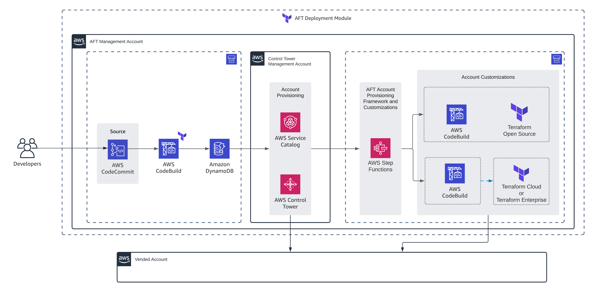
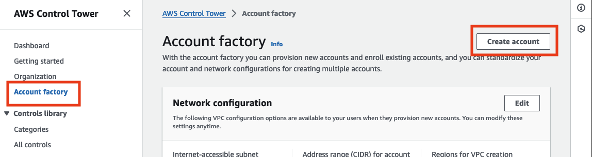
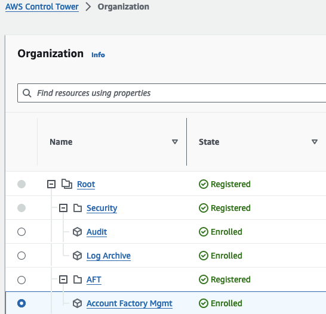
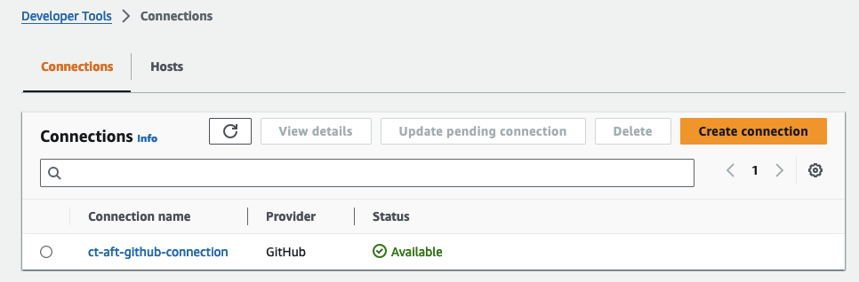
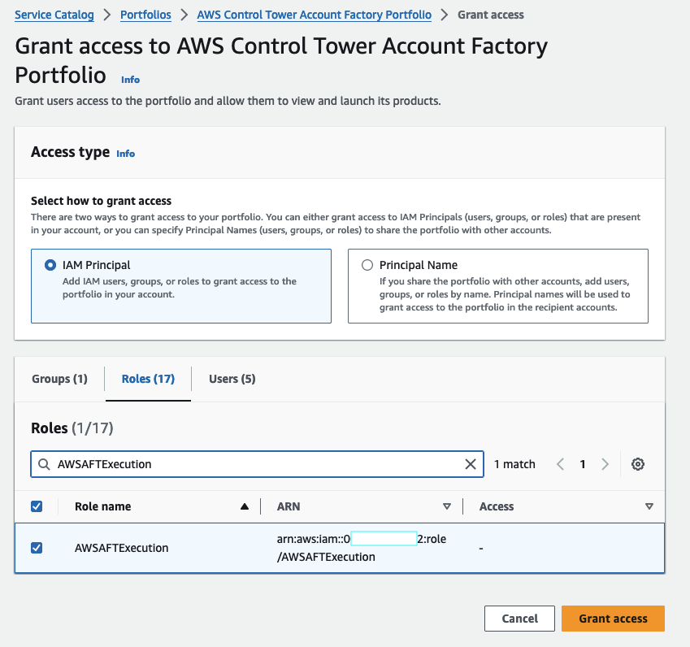

# tf-aws-aft
---

This is a repository to help the deployment of AWS Account Factory for Terraform.

## Overview

AWS Account structure

- **Control Tower Management Account** - An AWS account dedicated for your AWS Control Tower service. This account also typically referred to AWS payer account and AWS Organizations Management account.
- **AFT Management Account** - An AWS account dedicated for AFT management operations. This is different from organization's management account.
- **Vended Account** - An AWS account provisioned by AWS Control Tower, which contains all baseline and guardrails that you selected. AFT uses AWS Control Tower to vend a new account.




https://catalog.workshops.aws/control-tower/en-US/customization/aft


## Prerequistes

#### 1. Setup AWS Organizations

Enroll Management account into AWS Organziations via console.


#### 2. Setup AWS Control Tower

Setup AWS Control Tower via console. Follow prompts for the following information:

1. Regions
- Home Region
- Regions for Goverance 
- Additional Regions [https://docs.aws.amazon.com/controltower/latest/userguide/region-how.html]

2. Configure OUs 
- Foundational OU: Security (default)
- Additional OU (not required)

3. Create Shared Accounts
- Log Archive Account
- Audit Account

4. Additional configurations
- IAM Identity Center
- Log configuration for S3
- CloudTrail configuration
- KMS Encryption (see notes below)


## Setup

####  1. Create AFT Management Account

Navigate to your AWS Control Tower console

Create new OU for AFT Management Account
    - This can take up to 30 minutes


Create new account from Account Factory **not directly from AWS Organizations**



Enter the following information for account setup

- Account email: e.g. `aws+aft-mgmt@customer.com`
- Account name: e.g. `AFT-Management`
- IAM Identity Center user email
- IAM Identity Center user name
- OU

> **_NOTE:_**
The **SSOUserEmail** can be a new email address, or the email address associated with an existing IAM Identity Center user. Whichever you choose, this user will have administrative access to the account you're provisioning.
The **AccountEmail** must be an email address that isn't already associated with an AWS account. If you used a new email address in SSOUserEmail, you can use that email address here.

Once the account is setup, it should be enrolled in Control Tower automatically.



#### 2. Deploy Account Factory for Terraform (AFT)

It's best practice to setup a proper backend state for Terraform before deploying the AFT module. 

See `examples/terraform-state` for an exmaple to setup a new terraform state backend resources in AWS.

To deploy AFT, reference the module

```
module "aft" {
  source  = "github.com/clearscale/tf-aws-aft"

  accounts = var.accounts

  feature_enterprise         = false
  feature_audit_cloudtrail   = false
  feature_audit_metrics      = true
  feature_vpc_delete_default = true
  feature_vpc_endpoints      = true

  tf_version       = "1.5.7"
  tf_distribution  = "oss"
  tf_region_backup = "us-east-2"

  vpc_cidr                   = "192.168.0.0/22"
  vpc_private_subnet_01_cidr = "192.168.0.0/24"
  vpc_private_subnet_02_cidr = "192.168.1.0/24"
  vpc_public_subnet_01_cidr  = "192.168.2.0/25"
  vpc_public_subnet_02_cidr  = "192.168.2.128/25"

  vcs_provider                           = "github"
  repo_accounts                          = "https://github.com/clearscale/tf-aws-aft-accounts"
  repo_branch_accounts                   = "main"
  repo_aft_framework                     = "https://github.com/aws-ia/terraform-aws-control_tower_account_factory.git"
  repo_branch_aft_framework              = "main"
  repo_customization_account             = "https://github.com/clearscale/tf-aws-aft-customization-account"
  repo_branch_customization_account      = "main"
  repo_customization_global              = "https://github.com/clearscale/tf-aws-aft-customization-global"
  repo_branch_customization_global       = "main"
  repo_customization_provisioning        = "https://github.com/clearscale/tf-aws-aft-customization-account-provisioning"
  repo_branch_customization_provisioning = "main"
}
```

see the `examples/simple` for an example of using the module.

This terraform must be executed against the Control Tower Management account, not AFT account.


#### 3. Setup Github connections

If using Github, AWS CodeDeploy needs a connection to Github to monitor changes when new accounts are changed in the aft-accounts request repository.

In Control Tower Management Account
- Navigate to Developer Tools (under CodeCommit/CodeDeploy)
- Go to Settings > Connections
- Update Pending connection

Once complete, the connection will be updated to an Available status



More info on AWS Connections:
https://docs.aws.amazon.com/dtconsole/latest/userguide/welcome-connections.html

#### 4. Setup Service Catalog

Allow IAM role to access Service Catalog for AWS Control Tower

In Control Tower Management Account
- Navigate to Service Catalog (service)
- Navigate to Administration > Portfolios
- Open "AWS Control Tower Account Factory Portfolio"
- Click on "Access" tab
- Grant access
- Leave the default of IAM Principal (this will search in the current account)
- Below, select "Roles"
- Find the "AWSAFTExecution" for this account



See also `example/service-catalog` for a terraform example


## See also

https://docs.aws.amazon.com/controltower/latest/userguide/taf-account-provisioning.html

https://docs.aws.amazon.com/en_us/controltower/latest/userguide//sso-groups.html


https://docs.aws.amazon.com/controltower/latest/userguide/getting-started-from-console.html


## Notes 

##### General Guidance for AWS AFT

General guidance

    Do not modify or delete resources created by AWS Control Tower in the management account or in the shared accounts. Modification of these resources can require an update to your landing zone.
    Do not modify or delete the AWS Identity and Access Management (IAM) roles created within the shared accounts in the core organizational unit (OU). Modification of these resources can require an update to your landing zone.
    For more information on the resources created by AWS Control Tower, see Resources 

    in the AWS Control Tower User Guide.

AWS Organizations guidance

    Do not use AWS Organizations to update service control policies (SCPs) that are attached by AWS Control Tower to an AWS Control Tower managed OU. Doing so could result in the controls entering an unknown state, which will require you to re-enable affected controls in AWS Control Tower.
    Moving individual accounts into AWS Control Tower, outside of a registered OU, causes drift.
    If you use AWS Organizations to create, invite, or move accounts within an organization registered with AWS Control Tower, those accounts are not enrolled by AWS Control Tower and those changes are not recorded.
    If you use AWS Organizations to move an OU into an organization created by AWS Control Tower, the external OU is not registered by AWS Control Tower. Nested OUs are not accessible in AWS Control Tower, because AWS Control Tower displays only the top-level OUs.
    If you use AWS Organizations to rename an account or OU that was created by AWS Control Tower, you must repair your landing zone so that the new name is displayed by AWS Control Tower.
    If you use AWS Organizations to delete an OU that was created by AWS Control Tower, you also must delete the OU in AWS Control Tower. It cannot be used to contain accounts.

IAM Identity Center guidance

    If you reconfigure your directory in IAM Identity Center to Active Directory, all preconfigured users and groups in Identity Center will be deleted.

Account factory guidance

    When you use account factory to provision new accounts in AWS Service Catalog, do not define TagOptions, enable notifications, or create a provisioned product plan. Doing so can result in a failure to provision a new account.


#### KMS Setup

Requirements for KMS key
- Key type: Symmetric
- Key spec: SYMMETRIC_DEFAULT
- Key usage: Encrypt and decrypt
- Origin: AWS KMS
- Regionality: Single-Region key

https://docs.aws.amazon.com/controltower/latest/userguide/configure-kms-keys.html